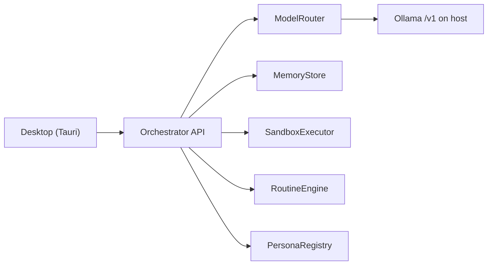

# Vrac

Open-source, self-hosted local assistant. 100% local inference, a Tauri desktop shell, and a Docker sandbox for tools. Apache-2.0.

Local install is supported. Orchestrator, sandbox, and Tauri UI are in the tree.

## Installation

Tutoriel Windows (PowerShell). Sous Linux et macOS, les commandes sont les mêmes.

### 1. Prérequis

- **Node.js 20+**
- **Ollama** installé et lancé **sur l'hôte** (pas dans Docker)
- **Git**
- **Docker** (optionnel) — sandbox local et VM isolée par persona
- **Rust** (optionnel) — uniquement pour la fenêtre desktop Tauri

Les modèles de test (`qwen2.5:0.5b` + `qwen3.5:4b`) tiennent dans bien moins de VRAM que la cible 27B. **Ne tirez pas le 27B** tant que le parcours e2e en petit modèle n'est pas validé.

### 2. Cloner

```powershell
git clone https://github.com/SilloVV/Vrac.git
cd Vrac
```

### 3. Config

```powershell
node scripts/setup.mjs
```

Cette commande copie `.env.example` vers `.env` s'il n'existe pas encore. Les modèles par défaut sont :

- `MODEL_MAIN=qwen3.5:4b`
- `MODEL_ROUTER=qwen2.5:0.5b`

L'API écoute `http://127.0.0.1:8787`. Ollama est attendu sur `http://127.0.0.1:11434/v1` (`INFERENCE_BASE_URL`).

### 4. Dépendances

```powershell
corepack enable && corepack prepare pnpm@9 --activate && pnpm install
```

### 5. Modèles

Ollama doit déjà tourner sur l'hôte, puis :

```powershell
node scripts/pull-models.mjs
```

Le script tire uniquement `qwen2.5:0.5b` (routeur) et `qwen3.5:4b` (modèle principal). **Pas le 27B.**

### 6. Lancer l'API

```powershell
pnpm --filter @grokbot/orchestrator start
```

L'orchestrateur écoute sur `http://127.0.0.1:8787`. Vérifier :

```powershell
curl http://127.0.0.1:8787/health
```

### 7. Lancer le desktop

Dans un second terminal, une fois l'API démarrée (Rust requis) :

```powershell
pnpm --filter @grokbot/desktop dev
```

Cela ouvre la fenêtre native Tauri. Le desktop n'est pas une app navigateur et n'est pas containerisé.

### 8. Premier usage

La fenêtre a 3 panneaux : les personas à gauche, le chat au centre, et le volet Computer à droite (VM Docker par persona + sandbox).

Personas livrées : `vrac`, `factual`, `creative`, `coder`. Ce sont des variations de system prompt sur le même modèle. Changer de persona sur un fil ne vide pas la mémoire.

Chaque persona peut avoir sa propre VM isolée, créée depuis le desktop ou via `POST /personas/ID/vm`. Les routines utilisent un cron 5 champs en heure locale, ou un trigger `on_startup` ; l'API les exécute et écrit dans un fil.

### 9. Variante Compose

```powershell
docker compose up --build
```

Compose lance **uniquement l'orchestrateur**. Ollama reste sur l'hôte (l'API le joint via `host.docker.internal:11434`). Le desktop Tauri n'est pas dans Compose : lancez-le à part avec `pnpm --filter @grokbot/desktop dev`.

### 10. Dépannage

- **`/health` indique `inference.reachable: false`** — Ollama n'est pas joignable. Démarrez-le sur l'hôte. En local : `INFERENCE_BASE_URL=http://127.0.0.1:11434/v1`. Sous Compose, l'orchestrateur utilise `http://host.docker.internal:11434/v1`.

- **Modèle introuvable** — relancez `node scripts/pull-models.mjs`. Ne tirez pas le 27B.

- **Le desktop ne se connecte pas** — démarrez d'abord l'API (`pnpm --filter @grokbot/orchestrator start`), puis le desktop.

- **Sandbox / VM** — Docker est optionnel pour le chat, requis pour le sandbox local (`SANDBOX_MODE=local`) et les VM par persona.

- **Port 8787 occupé** — l'API est sur `ORCHESTRATOR_HOST=127.0.0.1` et `ORCHESTRATOR_PORT=8787`.

## Why this vs Rakazo

Rakazo is a polished Grok-like desktop, but it leans on cloud pieces. Vrac is the same product shape, fully on your machine:

- **100% local Ollama** — no OpenRouter, no remote LLM fallback.
- **Tauri, not Electron** — small native window, no Chromium bundle.
- **SQLite, not Postgres** — memory lives in a local file; no database server to run.
- **VRAM `keep_alive`** — ModelRouter never keeps main and small loaded together.
- **Per-persona isolated Docker VM** — each bot gets its own sandbox computer.
- **No auth required** — loopback API at `http://127.0.0.1:8787`.

## Architecture



- **Desktop** — native window; talks to the API at `http://127.0.0.1:8787`.
- **Orchestrator** — Hono HTTP API. Wires packages; calls Ollama through the OpenAI-compatible client.
- **ModelRouter** — main vs small model. VRAM budget: never keep both loaded; unload small before loading main (`keep_alive`).
- **Memory** — SQLite by default; Postgres later via `DATABASE_URL`. Switching persona does not wipe a thread.
- **Sandbox** — `SANDBOX_MODE=local` (Docker, spawned on demand) or `remote` (E2B). Never execute on the host.
- **Routines** — scheduled or triggered prompts.
- **Personas** — YAML files; system-prompt variations over the same model.

## Hardware

- **24 GB GPU minimum** for the target 27B Q4 main model.
- **NVMe** recommended for model load times.
- **Turing** (e.g. RTX 20-series / T4): no native FP8 / bf16. Stay on Q4_K_M / Q4 / Q5 quants.

Test-phase models (`qwen2.5:0.5b` + `qwen3.5:4b`) fit in far less VRAM. Do **not** pull the 27B until small-model e2e is validated.

