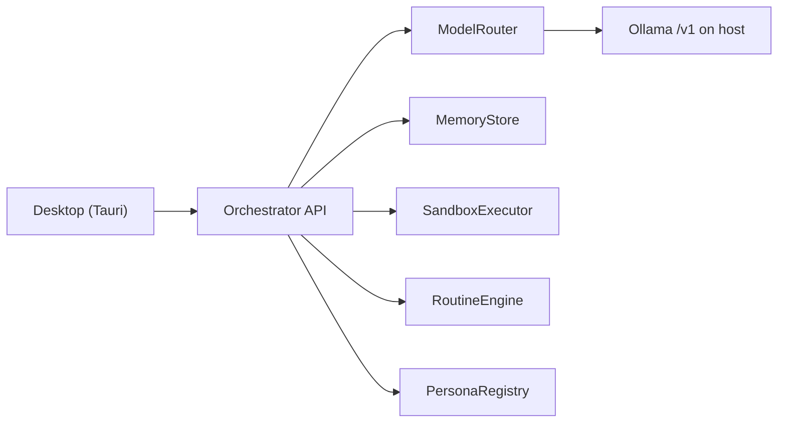

# Vrac

Open-source, self-hosted local assistant. 100% local inference, a Tauri desktop shell, and a Docker sandbox for tools. Apache-2.0.

Local install is supported. Orchestrator, sandbox, and Tauri UI are in the tree.

## Why this vs Rakazo

Rakazo is a polished Grok-like desktop, but it leans on cloud pieces. Vrac is the same product shape, fully on your machine:

- **100% local Ollama** — no OpenRouter, no remote LLM fallback.
- **Tauri, not Electron** — small native window, no Chromium bundle.
- **SQLite, not Postgres** — memory lives in a local file; no database server to run.
- **VRAM `keep_alive`** — ModelRouter never keeps main and small loaded together.
- **Per-persona isolated Docker VM** — each bot gets its own sandbox computer.
- **No auth required** — loopback API at `http://127.0.0.1:8787`.

## Architecture

- **Desktop** — native window; talks to the API at `http://127.0.0.1:8787`.
- **Orchestrator** — Hono HTTP API. Wires packages; calls Ollama through the OpenAI-compatible client.
- **ModelRouter** — main vs small model. VRAM budget: never keep both loaded; unload small before loading main (`keep_alive`).
- **Memory** — SQLite by default; Postgres later via `DATABASE_URL`. Switching persona does not wipe a thread.
- **Sandbox** — `SANDBOX_MODE=local` (Docker, spawned on demand) or `remote` (E2B). Never execute on the host.
- **Routines** — scheduled or triggered prompts.
- **Personas** — YAML files; system-prompt variations over the same model.

## Hardware

- **24 GB GPU minimum** for the target 27B Q4 main model.
- **NVMe** recommended for model load times.
- **Turing** (e.g. RTX 20-series / T4): no native FP8 / bf16. Stay on Q4_K_M / Q4 / Q5 quants.

Test-phase models (`qwen2.5:0.5b` + `qwen3.5:4b`) fit in far less VRAM. Do **not** pull the 27B until small-model e2e is validated.

## Prerequisites

- Node 20+
- Ollama on the host
- Docker optional
- Rust optional for the desktop window

Routines use a 5-field cron in local time, or trigger on_startup. The API ticks them and writes into a thread.

Each persona can have its own isolated VM. Create it from the desktop or POST /personas/ID/vm.
