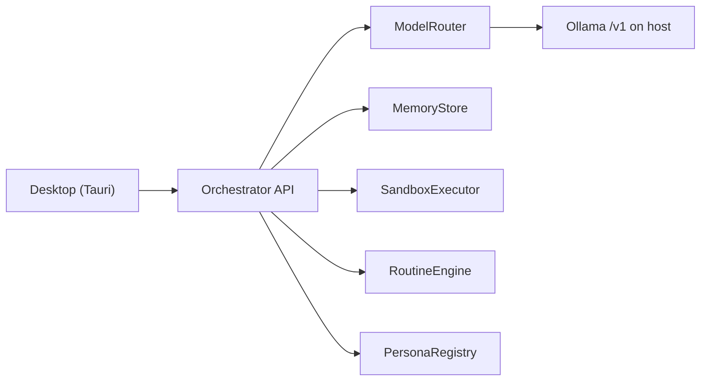

# Vrac

**Your own team of local AI bots, in a chat app.**

A self-hosted take on the Grok Bot shape — 100% local Ollama, a Tauri desktop shell, and a Docker VM per persona. Apache-2.0.


Local install is supported. Orchestrator, sandbox, and Tauri UI are in the tree.

## Why

One assistant in one box is the wrong shape for agents. Vrac keeps the idea — AI as a *messaging app*: a roster of personas you chat with, each with its own tone, thread memory, and computer — and rebuilds it fully on your machine:

- **100% local inference.** Bots run on Ollama on the host. No OpenRouter, no remote LLM fallback, no cloud API key.
- **Local first.** One orchestrator on `127.0.0.1:8787` owns every turn. Threads live in SQLite, not a hosted database.
- **Agents with hands.** Each persona can get an isolated Docker VM it drives from the Computer pane — spawned on your machine, not a cloud Box.

## Features

- **Personas like contacts** — YAML roster (`vrac`, `factual`, `creative`, `coder`). Same model; only prompt, tone, and sampling change. Switching persona does not wipe a thread.
- **A computer per persona** — isolated Docker VM from the Computer pane. Chat works without Docker; tools need it.
- **VRAM-aware routing** — ModelRouter never keeps main and small loaded together. Unloads `qwen2.5:0.5b` before `qwen3.5:4b` (`keep_alive`).
- **Routines** — 5-field cron in local time, or `on_startup`. The API runs the prompt and writes into a thread.
- **Loopback, no login** — API on `http://127.0.0.1:8787`. No auth, no account, no cloud key.
- **3-pane Tauri desktop** — personas, chat, Computer. Native window, not a browser app, not containerized.
- **Locked-down sandbox** — local Docker (`--network none`, `--cap-drop ALL`); optional E2B remote fallback.

## Pourquoi Vrac vs OpenMausBot / Rakazo

Same product shape (a roster of bots in a chat app). Different stack.

| | OpenMausBot / Rakazo | Vrac |
| --- | --- | --- |
| Shell | Electron | **Tauri** |
| Brain | Claude / Codex / Grok CLIs | **Ollama, 100% local** |
| Computer | Cloud Box | **Docker VM per persona** |
| Apps | Composio | none (local tools only) |
| Memory | local folder / hosted pieces | **SQLite** |
| Keys | provider + Composio + Box | **no cloud key** |

## How it works

Two processes. The Tauri desktop holds no inference of its own — it talks HTTP to the orchestrator. The orchestrator wires packages, routes models through Ollama on the host, and never executes user commands on the host.



| Layer | Where | What it does |
| --- | --- | --- |
| Desktop | `apps/desktop/` | Native Tauri window. 3 panes: personas, chat, Computer. Talks to `http://127.0.0.1:8787`. Not a browser app, not containerized. |
| Orchestrator | `apps/orchestrator/` | Hono HTTP API. Wires packages; calls Ollama through the OpenAI-compatible client. |
| ModelRouter | `packages/inference/` | Main vs small model. VRAM budget: never keep both loaded; unload small before loading main (`keep_alive`). |
| Memory | `packages/memory/` | SQLite by default; Postgres later via `DATABASE_URL`. Switching persona does not wipe a thread. |
| Sandbox | `packages/sandbox/` | `SANDBOX_MODE=local` (Docker, spawned on demand) or `remote` (E2B). Never execute on the host. Per-persona isolated VM via `POST /personas/:id/vm`. |
| Routines | `packages/routines/` | Cron (5-field, local time) or `on_startup`. Writes into a thread. |
| Personas | `packages/personas/` + `personas/` | YAML loader + registry. System-prompt variations over the same model. |

## Quick start

Tutoriel Windows (PowerShell). Sous Linux et macOS, les commandes sont les mêmes.

### 1. Prérequis

- **Node.js 20+**
- **Ollama** installé et lancé **sur l'hôte** (pas dans Docker)
- **Git**
- **Docker** (optionnel) — sandbox local et VM isolée par persona
- **Rust** (optionnel) — uniquement pour la fenêtre desktop Tauri

Les modèles de test (`qwen2.5:0.5b` + `qwen3.5:4b`) tiennent dans bien moins de VRAM que la cible 27B. **Ne tirez pas le 27B** tant que le parcours e2e en petit modèle n'est pas validé.

### 2. Cloner

```powershell
git clone https://github.com/SilloVV/Vrac.git
cd Vrac
```

### 3. Config

```powershell
node scripts/setup.mjs
```

Cette commande copie `.env.example` vers `.env` s'il n'existe pas encore. Les modèles par défaut sont :

- `MODEL_MAIN=qwen3.5:4b`
- `MODEL_ROUTER=qwen2.5:0.5b`

L'API écoute `http://127.0.0.1:8787`. Ollama est attendu sur `http://127.0.0.1:11434/v1` (`INFERENCE_BASE_URL`).

### 4. Dépendances

```powershell
corepack enable && corepack prepare pnpm@9 --activate && pnpm install
```

### 5. Modèles

Ollama doit déjà tourner sur l'hôte, puis :

```powershell
node scripts/pull-models.mjs
```

Le script tire uniquement `qwen2.5:0.5b` (routeur) et `qwen3.5:4b` (modèle principal). **Pas le 27B.**

### 6. Lancer l'API

```powershell
pnpm --filter @grokbot/orchestrator start
```

L'orchestrateur écoute sur `http://127.0.0.1:8787`. Vérifier :

```powershell
curl http://127.0.0.1:8787/health
```

### 7. Lancer le desktop

Dans un second terminal, une fois l'API démarrée (Rust requis) :

```powershell
pnpm --filter @grokbot/desktop dev
```

Cela ouvre la fenêtre native Tauri. Le desktop n'est pas une app navigateur et n'est pas containerisé.

### 8. Premier usage

La fenêtre a 3 panneaux : les personas à gauche, le chat au centre, et le volet Computer à droite (VM Docker par persona + sandbox).

Personas livrées : `vrac`, `factual`, `creative`, `coder`. Ce sont des variations de system prompt sur le même modèle. Changer de persona sur un fil ne vide pas la mémoire.

Chaque persona peut avoir sa propre VM isolée, créée depuis le desktop ou via `POST /personas/ID/vm`. Les routines utilisent un cron 5 champs en heure locale, ou un trigger `on_startup` ; l'API les exécute et écrit dans un fil.

### 9. Variante Compose

```powershell
docker compose up --build
```

Compose lance **uniquement l'orchestrateur**. Ollama reste sur l'hôte (l'API le joint via `host.docker.internal:11434`). Le desktop Tauri n'est pas dans Compose : lancez-le à part avec `pnpm --filter @grokbot/desktop dev`.

### 10. Dépannage

- **`/health` indique `inference.reachable: false`** — Ollama n'est pas joignable. Démarrez-le sur l'hôte. En local : `INFERENCE_BASE_URL=http://127.0.0.1:11434/v1`. Sous Compose, l'orchestrateur utilise `http://host.docker.internal:11434/v1`.

- **Modèle introuvable** — relancez `node scripts/pull-models.mjs`. Ne tirez pas le 27B.

- **Le desktop ne se connecte pas** — démarrez d'abord l'API (`pnpm --filter @grokbot/orchestrator start`), puis le desktop.

- **Sandbox / VM** — Docker est optionnel pour le chat, requis pour le sandbox local (`SANDBOX_MODE=local`) et les VM par persona.

- **Port 8787 occupé** — l'API est sur `ORCHESTRATOR_HOST=127.0.0.1` et `ORCHESTRATOR_PORT=8787`.

### Hardware

- **24 GB GPU minimum** for the target 27B Q4 main model.
- **NVMe** recommended for model load times.
- **Turing** (e.g. RTX 20-series / T4): no native FP8 / bf16. Stay on Q4_K_M / Q4 / Q5 quants.

Test-phase models (`qwen2.5:0.5b` + `qwen3.5:4b`) fit in far less VRAM. Do **not** pull the 27B until small-model e2e is validated.

## Status

Early but real — the loop works end to end: message -> orchestrator -> Ollama -> streamed reply -> sandbox / persona VM -> routines. Local install is supported. Orchestrator, sandbox, and Tauri UI are in the tree.

Rough edges to expect: test-phase models only (`qwen2.5:0.5b` + `qwen3.5:4b`). Do **not** pull the 27B until small-model e2e is validated. Turing GPUs stay on Q4 / Q5 quants. No packaged installer yet — run from source. E2B remote sandbox is optional and unused in the default local path.

Contributions welcome — see [CONTRIBUTING.md](CONTRIBUTING.md). One branch per feature, PR into `main`.

## License

[Apache-2.0](LICENSE)

Vrac is an independent, open-source project inspired by the Grok Bot product shape (and by open takes such as [OpenMausBot](https://github.com/milind-soni/OpenMausBot)). It is not affiliated with, endorsed by, or associated with xAI or OpenMausBot.
