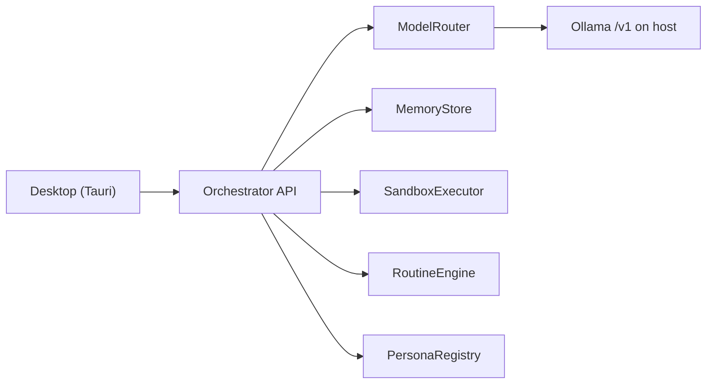

# grokbot-local

Open-source, self-hosted Grok-like assistant. 100% local inference, a Tauri desktop shell, and a Docker sandbox for tools. Apache-2.0.

This repository is a **skeleton**: interfaces, stubs, config, and docs. No real inference, sandbox, or scheduler yet.

## Architecture

- **Desktop** — native window; talks to the API at `http://127.0.0.1:8787`.
- **Orchestrator** — Hono HTTP API. Wires packages; does not call Ollama in this skeleton.
- **ModelRouter** — main vs small model. VRAM budget: never keep both loaded; unload small before loading main (`keep_alive`).
- **Memory** — SQLite by default; Postgres later via `DATABASE_URL`. Switching persona does not wipe a thread.
- **Sandbox** — `SANDBOX_MODE=local` (Docker, spawned on demand) or `remote` (E2B). Never execute on the host.
- **Routines** — scheduled or triggered prompts.
- **Personas** — YAML files; system-prompt variations over the same model.

## Hardware

- **24 GB GPU minimum** for the target 27B Q4 main model.
- **NVMe** recommended for model load times.
- **Turing** (e.g. RTX 20-series / T4): no native FP8 / bf16. Stay on Q4_K_M / Q4 / Q5 quants.

Test-phase models (`qwen2.5:0.5b` + `qwen2.5:1.5b`) fit in far less VRAM. Do **not** pull the 27B until small-model e2e is validated.

## Prerequisites

- Node 20+
